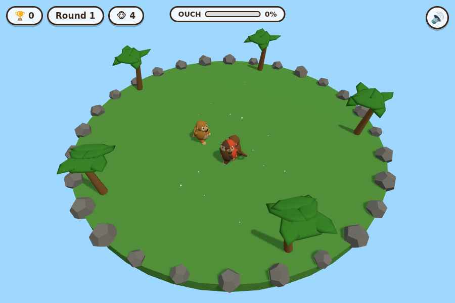

# 🐵 Monkey Mayhem

A goofy **3D monkey brawler** for the browser, built to be published on
[Poki](https://developers.poki.com/). Punch rivals, fling bananas, and **yeet**
your opponents off a floating jungle arena. Last monkey standing wins the round!



## Play

It's a static site — no build step. Just serve the folder over HTTP:

```bash
npx serve .
# or
python3 -m http.server 8000
```

Then open `http://localhost:8000`. (Opening `index.html` directly with `file://`
won't work because it uses ES modules.)

### Controls

| Action | Desktop | Touch |
| --- | --- | --- |
| Move | `WASD` / Arrows | Left joystick |
| Punch | `J` / `Z` / Left-click | 👊 button |
| Throw banana | `K` / `X` / Right-click | 🍌 button |
| Jump | `Space` | JUMP button |

## How it plays

- Knock other monkeys off the floating island to score KOs.
- Damage works like Smash Bros — the more **OUCH%** a monkey has, the further it
  flies. Rack up damage, then launch them into the clouds.
- Each round adds more (and tougher) rival monkeys.
- Brief spawn invulnerability (blinking) keeps you from being instantly mobbed.

## Tech

- **[Three.js](https://threejs.org/)** for 3D rendering (vendored in `vendor/`,
  so the game runs fully offline / self-contained — a Poki requirement).
- All art is generated from primitives; all SFX/music are synthesized with the
  Web Audio API. **Zero external asset files.**
- No bundler — native ES modules + an import map.

### Project layout

```
index.html        # entry, UI overlays, import map, Poki SDK <script>
style.css         # cartoon UI
vendor/three.module.js
src/
  main.js         # boot, UI/state machine, round flow, ad calls
  game.js         # game loop, physics, combat, AI, camera
  monkey.js       # monkey model + procedural animation
  arena.js        # floating island, sky, lights, decoration
  effects.js      # particles + screen shake
  input.js        # keyboard / mouse / touch
  audio.js        # Web Audio synth (SFX + music)
  poki.js         # Poki SDK wrapper (no-ops when SDK absent)
```

## Poki integration

The [Poki SDK](https://sdk.poki.com/) is loaded via the `<script>` tag in
`index.html` and wrapped in `src/poki.js`. When the SDK isn't present (local dev),
every call gracefully no-ops so the game runs identically.

Integrated touch points:

- `init()` on boot, `gameLoadingFinished()` after the first frame.
- `gameplayStart()` / `gameplayStop()` around active play (also on tab
  visibility changes).
- `commercialBreak()` between rounds (interstitial).
- `rewardedBreak()` for the optional "watch ad to revive" on game over.

### Submitting to Poki

1. Create a game in the [Poki Developer Dashboard](https://developers.poki.com/).
2. Zip the whole repo (it's already self-contained) and upload it via the
   Poki Inspector / dashboard.
3. The Inspector validates the SDK calls above. Everything is wired up already.

## Ideas / TODO

- Power-ups (giant fist, banana-peel slip traps, rocket boost).
- Distinct monkey characters with different stats.
- 2-player local co-op or versus.
- Persistent high score (localStorage).
